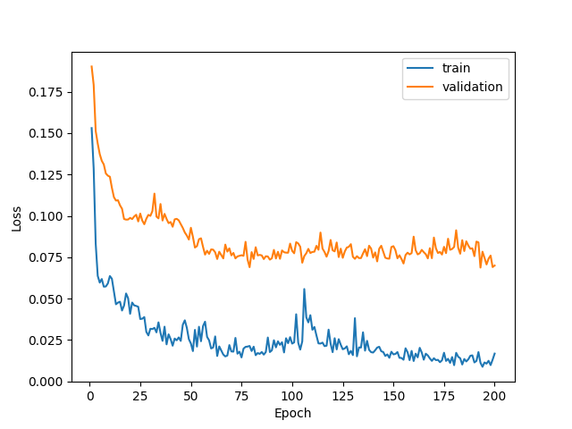
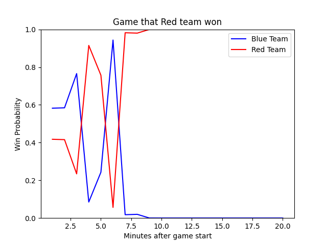

# Estimating win probability of multi-player online battle arena games using mid-game statistics

## Project Directory

```
|- dataset
|- neural-network
|- pytorch
|   |- dataset
|   |- data
|   |- models
```

### dataset
This directory contains codes used to crawl raw data from Riot API. Through requests to Riot match APIs, it crawls match timeline data into json files.

### neural-network
This directory contains attempts to analyze dataset using tensorflow framework. It contains ipython notebook files that shows preliminary results on the dataset.

### pytorch
This diectory contains pytorch implementation of the actual model used for the analysis. It contains codes used for the training, testing, and evaluating the model, as well as codes used to preprocess the raw data.


## Quickstart

### Setting up environment
The project runs on Python3 environment. Install the required packages by running
```
pip3 install -r requirements.txt
```

### Download Dataset

You can download the dataset using [fetching_timeline.ipynb](/dataset/fetching_timeline.ipynb). This code will crawl match timeline data into json files. Make sure to replace api key as the one uploaded is expired.

### Preprocess Dataset
Go to [pytorch/dataset](./pytorch/dataset) directory. Place all of the json files in [pytorch/dataset/timelines](./pytorch/dataset/timelines/) directory. Then, you can separate the train data and test data by running
```{shell}
python3 separate.py
```

Then, randomly selected 10% of the files will be moved to [pytorch/dataset/test_timelines](./pytorch/dataset/test_timelines/) directory. 

We can parse a dataset into a single csv file. [stats_inter_list.txt](./pytorch/dataset/stats_inter_list.txt) file is a list of match statistics we intend to include as attributes of the instances. Parsing script will select statistics listed in the file as attributes of the instances, and it will also normalize the values match by match. To parse dataset into a single csv file, run

```
python3 parse_dataset.py timelines timelines.csv stats_inter_list.txt
```

It will create timelines.csv file.

To parse test dataset into a csv file as well, run

```
python3 parse_dataset.py test_timelines test_timelines.csv stats_inter_list.txt
```

### Train
To train the model, go to [pytorch](./pytorch/) directory. You can train the model by running [train.py](./pytorch/train.py) script. Run

```
python3 train.py <path to dataset> <EPOCH> <BATCH_SIZE> <LEARNING_RATE>
```

In this tutorial, we can run

```
python3 train.py dataset/timelines.csv 200 256 0.001
```

The model will print out the loss values, and at the end of the training, it will show the loss graph and save the weights of the trained model in [checkpoints](./pytorch/checkpoints/) directory. 



### Test
To train the model, go to [pytorch](./pytorch/) directory. You can train the model by running [test.py](./pytorch/test.py) script. Run

```
python3 test.py <path to the model> <path to test dataset>
```

In this tutorial, we can run
```
python3 test.py checkpoints/epoch200_batch256_lr0.001_timeframe.pth dataset/test_timelines.csv
```

It will generate two graphs that are required to evaluate the performance of the model.


### Evaluate a match performance
To use the model on the match data, use [evaluate.py](./pytorch/evaluate.py) script. Run

```
python3 evaluate.py <path to model checkpoint> <directory containing match file> <match idx> <include item purchase>
```

The script will look for json files in the path given as the second argument of the program and select <match_idx>th file as the source match data. If \<include item purchase\> argument is True, it will print out item purchase entries as well. Otherwise, it will not print out item purchase entries.

In this tutorial, we can run


```{shell}
python3 evaluate.py checkpoints/epoch200_batch256_lr0.001_timeframe.pth dataset/test_timelines 10 True
```

One of the results from match evaluations is as follows.



## Contributors
- Minh Nguyen [@minh160302](https://github.com/minh160302)
- Quan Nguyen [@quannguyen02](https://github.com/quannguyen02)
- SeBeom Lee [@k2sebeom](https://github.com/k2sebeom)
